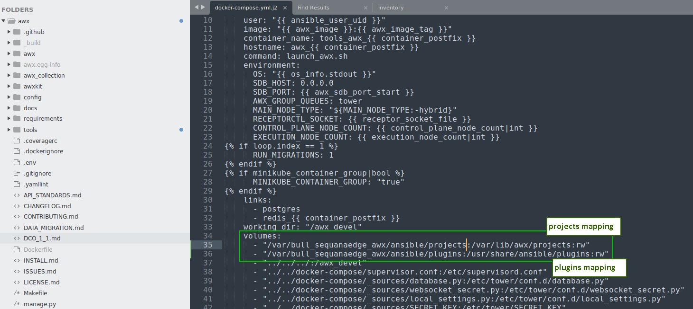
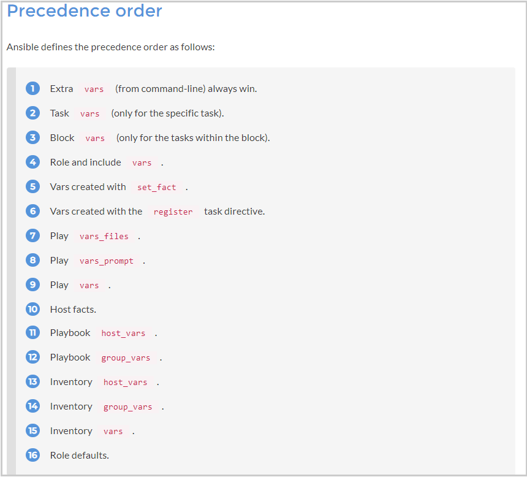

# BullSequana Edge/SH Ansible Playbooks and Modules

BullSequana Edge/SH Ansible Playbooks and Modules allows Data Center and IT administrators to use RedHat Ansible or AWX to automate and orchestrate the operations (power, update) of BullSequana Edge/SH.

## Supported Platforms
BullSequana Edge/SH

## Prerequisites
Ansible playbooks can be used as is with following prerequisites:
  * AWX Operator 21.0>+  :computer: See https://github.com/ansible/awx/blob/devel/INSTALL.md
  * AWX CLI 21.0>+  :computer: See https://github.com/ansible/awx/blob/devel/INSTALL.md#installing-the-awx-cli
  * Ansible 2.10>+
  * Python 3.8>+
  * modules Python : ansible-vault and tzlocal (delivered in "prerequisites" directory)

## Summary
- [BullSequana Edge/SH Playbooks](#playbooks)
- [What to do first on AWX](#what_awx)
- [What to do first on Ansible](#what_ansible)
- [How to manage AWX encrypted passwords](#howto_manage_ansible_password)
- [How to manage Ansible encrypted passwords](#howto_manage_awx_password)
- [How to configure your proxy](#howto_proxy)
- [How to configure your technical states file path](#howto_ts)
- [Warning for updates](#warning_updates)
- [More help](#more_help)
- [Support](#support)
- [LICENSE](#license)
- [Version](#version)

## <a name="playbooks"></a>BullSequana Edge/SH Playbooks
- `Activate firmware updates`: Activate BullSequana Edge/SH uploaded firmwares - Do NOT upload firmwares (need to be planed before)
- `Evaluate firmware update from Technical State`:Evaluate firmware update from Atos specific Technical State file (comparaison)
- `Delete firmware image`: Delete a firmware image by id
- `Firmware inventory` - Active: Get firmware inventory in "Active" state
- `Firmware inventory - Ready`: Get firmware inventory in "Ready" state
- `BIOS Boot Mode`: Get current BIOS Boot Mode
- `Set BIOS Boot Mode Regular`: Set BIOS Boot Mode to Regular
- `Set BIOS Boot Mode Safe`: Set BIOS Boot Mode to Safe
- `Set BIOS Boot Mode Setup`: Set BIOS Boot Mode to Setup
- `BIOS Boot Source`: Get current BIOS Boot Source
- `Set BIOS Boot Source Default`: Set BIOS Boot Source to Default
- `Set BIOS Boot Source Disk`: Set BIOS Boot Source to Disk
- `Set BIOS Boot Source Media`: Set BIOS Boot Source to Media
- `Set BIOS Boot Source Network`: Set BIOS Boot Source to Network
- `Update firmware from file`: Update Firmware from a file (tar or gzip file)
- `Update firmwares from Technical State`: Update all Firmwares from technical state (Atos specific TS file)
- `Upload firmware images from Technical State`: Upload images from technical state (Atos specific TS file) - Do NOT activate firmwares (need to be planed after)
- `Check critical high and low alarms`: Check critical high and low alarm states from sensors
- `Check warning high and low alarms`: Check warning high and low alarm states from sensors
- `State BMC`: Get BullSequana Edge/SH current BMC state
- `State Chassis`: Get BullSequana Edge/SH current chassis state 
- `State Host`:Get BullSequana Edge/SH current host state
- `Get FRU`: Get BullSequana Edge/SH FRU information
- `Get Network`: Get BullSequana Edge/SH Network information
- `Get Sensors`: Get BullSequana Edge/SH Sensors information
- `Get System`: Get BullSequana Edge/SH System information
- `Check Rsyslog Server IP and Port`: Compare Rsyslog Server IP and Port to variables defined in inventory
- `Rsyslog Server IP and Port`: Get BullSequana Edge/SH Rsyslog IP and Port
- `NTP Server Ip and Sync`: NTP Server Ip and Sync
- `Set Rsyslog Server IP`: Set Rsyslog BullSequana Edge/SH IP
- `Set Rsyslog Server Port: `Set Rsyslog BullSequana Edge/SH Port
- `Set NTP Server Ip and Sync`: Set BullSequana Edge/SH Server Ip and Sync
- `Immediate Shutdown`: Request an Immediate Shutdown
- `Check BMC alive`: Check if BullSequana Edge/SH device is alive
- `Check Power Off`: Check if BullSequana Edge/SH host is powered off
- `Check Power On`: Check if BullSequana Edge/SH host is powered on
- `Get LED state`: Get BullSequana Edge/SH LED state
- `Power Cap`: Get BullSequana Edge/SH Power Cap
- `Orderly Shutdown`: Request an Orderly Shutdown
- `Power On`: Request a Power On
- `Reboot`: Reboot the BullSequana Edge/SH BMC
- `Set LED on/off`: Set BullSequana Edge/SH LED state
- `Set Power Cap on/off`: Set BullSequana Edge/SH Power cap on/off

## <a name="what_awx"></a>What to do first on AWX

### get it !
You can get it from
- Bull SOL (Support on line)
- get zip from this repository
- clone this repository  


from zip file, just unzip the file:  
```
unzip <your_zip>
```

from this repository, just clone:   
```
git clone https://github.com/atosorigin/bull_sequanaedge_awx.git
```

### create your superuser
As indicated in the documentation, create your first super user:
`docker exec -ti tools_awx_1 awx-manage createsuperuser`


:computer: INFO: See https://github.com/ansible/awx/blob/devel/tools/docker-compose/README.md#create-an-admin-user
  
You should be able to login


### install your playbooks
You may use the "ansible/projects/openbmc" directory as is or you can copy it elsewhere.


:warning: Warning: Care to add the correct volume in your **docker-compose.yml.j2** file :
- Edge: **projects/openbmc** directory
- SH: **projects/redfish** directory



:rotating_light: Alert:You should re-run **docker-compose-build** for any change in your **docker-compose.yml.j2** file

` make docker-compose-build `
` make docker-compose `


### install your plugins
*Edge only: plugins is NOT needed for BullSequanaSH systems*
You may copy your plugins in the shared ansible module directory.

:warning: If you use kube or docker : you should map the plugins directory


:warning: Warning: You should re-run **docker-compose-build** if you change the **docker-compose.yml.j2** file

` make docker-compose-build `
` make docker-compose `


### change your inventory variables 

:warning: Warning : default variables are defined in **ansible/projects/<openbmc or redfish>/vars/external_vars**

You should change the *Variables* in the file <target_dir>/<openbmc or redfish>/vars/external_vars.yml declared in your volume.

You may add/change *Variables*  in AWX inventory variables, if you remove it from your vars/external_vars.yml file.


The following chapter explains the meaning of all variables.
#### - countdowns
activating_countdown  
:arrow_right:default: 30 SECONDS   
:arrow_right:used in: activate_firmware_update, update_firmware_from_file, update_firmwares  
  
poweroff_countdown  
:arrow_right:default: 5 SECONDS  
:arrow_right:used in: power_on.yml  
  
poweron_countdown   
:arrow_right:default: 5 SECONDS  
:arrow_right:used in: power_on.yml
  
reboot_countdown  
:arrow_right:default: 3 MINUTES  
:arrow_right:used in: reboot.yml, update_firmware_from_file, update_firmwares  
  
#### - file_to_upload
:arrow_right:used in: update_firmware_from_file

:warning: **file_to_upload** variable is defined **localy** : the file is sent to the server
  
Change the external_vars section as needed:  
` file_to_upload: /var/lib/awx/mnt/Resources/your_image.ext" `  
Adjust the prompt on launch option as needed:    
`prompt on launch`  

#### - forceoff
:arrow_right:default: **False**  
:arrow_right:used in: activate_firmware_update, update_firmware_from_file, update_firmwares

if you never want to automatically force the remote server power off, you need to change **forceoff** variable in your inventory / variable part:  

`forceoff = False`

:warning: Warning if **forceoff** = False
- Default is **True** meaning the BMC will power off automatically the host (server) during BIOS update   
- Playbooks needing a **forceoff** will not activate BIOS update: BIOS update will be effective next power off / on cycle  
- *power_off.yml* does NOT care this variable  

#### - maxretries
activating_maxretries  
:arrow_right:default: 10 times  
:arrow_right:used in: activate_firmware_update, update_firmware_from_file, update_firmwares

reboot_maxretries  
:arrow_right:default: 10 times  
:arrow_right:used in: reboot.yml, update_firmware_from_file, update_firmwares
  
poweroff_maxretries  
:arrow_right:default: 10 times  
:arrow_right:used in: power_off.yml, update_firmware_from_file, update_firmwares

poweron_maxretries  
:arrow_right:default: 10 times  
:arrow_right:used in: power_on.yml

#### - ntp_server_ip / ntp_server_sync
:arrow_right:default: NTP  
:arrow_right:used in: set_ntp_server_ip_and_sync.yml  

#### - power_cap
:arrow_right:default: 500  
:arrow_right:used in: set_power_cap_on.yml

So, the **power_cap** variable is defined localy inside external_vars section of the playbook

Change the external_vars section as needed:  
`power_cap: 500`  

Adjust the prompt on launch option as needed, you can unselect it:  
`prompt on launch`


By default, the "prompt on launch" option is selected and this is a way to change the value on the fly, a pop-up window will appear at each launch:


#### - purpose_to_delete / version_to_delete
:arrow_right:used in: delete_firmware_image.yml

purpose_to_delete: possible values: Bios or Bmc or Host

#### - rsyslog_server_ip / rsyslog_server_port
:arrow_right:default port: 514  
:arrow_right:used in: set_rsyslog_server_ip_and_port.yml

#### - reboot
:arrow_right:default: **True**  
:arrow_right:used in: reboot.yml, update_firmware_from_file, update_firmwares

if you never want to automatically reboot the BMC, you need to change *reboot* variable in your inventory / variable part:  
`reboot = False`


:warning: Warning if **reboot** = False
- Default is True meaning the BMC will reboot automatically after an update  
- Playbooks needing a **reboot** will not proceed to reboot: BMC update will be effective next reboot   
- *reboot.yml* playbook does NOT care this variable and force the reboot

#### - technical_state_path variable
:arrow_right:default: /mnt   
:arrow_right:used in: reboot.yml, update_firmware_from_file, update_firmwares  

The technical state path should point to a technical state directory - technical state (TS) file delivered by Atos.
The default value is mapped to the /mnt root of the host, in other words, /mnt in your container (kube or docker):  
`technical_state_path = /mnt`  

example:
```sh
  volumes:
    - /mnt:/mnt:ro
```


  
For more information [See How to change technical states file path](#howto_ts)

#### - token_timeout
:arrow_right:default: 5 SECONDS  
:arrow_right:used in all playbooks for the connection

#### - rsyslog_server_ip / port
:arrow_right:default: **True**   
:arrow_right:used in: check_rsyslog_server_ip_and_port.yml, set_rsyslog_server_ip.yml, set_rsyslog_server_port.yml
  
## How to add a credential
AWX has a native vault capability.
### - add an AWX vault password
1. go to AWX Credentials
2. add your vault *Bull Sequana Edge/SH Vault*
3. add a vault password


4. save your change

  
### - generate your passwords
You can now generate your passwords: See [How to manage AWX encrypted passwords](#howto_manage_awx_password)
You should generate as many *password variables* as different real passwords you have.

### - use it in your inventory
1. go to AWX Inventory
2. select the host where you need to customize the password
3. add "password:" variable for each host

```
password: "{{root_password_for_edge}}"
```


### check job template credential
You can check the credential of your job template:
1. go to Templates
2. select a job template
3. check the Credential section


### check with clear password
For test purpose, you can always use a clear password in a host:
1. go to Inventory
2. select a host
3. change the password in clear


## <a name="what_ansible"></a>What to do first on Ansible

### what is the content
Bull Sequana Edge/SH Ansible playbooks contains:
1. Playbooks
2. One Inventory Plugin for nmap detection
3. One Callback Plugin for better CLI stdout UX 

### how to install ansible
#### <a name="install_locally"></a>install ansible locally
If you already have an Ansible installation, you can just install ansible playbooks and plugins:  
1. install python3 as a prerequisite   
`yum install python3`  
2. install ansible  
`pip3 install ansible`  
3. optionnaly if you use Ansible vault:  
`pip3 install pycryptodome`  
`pip3 install ansible-vault`  
4. optionnaly if you use Ansible role installation:  
```sh
pip3 install awxkit
awx --help
```

### install your plugins
Copy your plugins in the shared ansible modules directory.  
Default is :  
- /usr/share/ansible/plugins/modules ==> modules  
- /usr/share/ansible/plugins/module_utils ==> module utils  

Another option is to create symbolic links :
From your <install_dir>/ansible/plugins/<modules or module_utils>/remote_management :
`ln -s atos_openbmc.py /usr/share/ansible/plugins/modules/remote_management/atos_openbmc.py`
`ln -s atos_openbmc_utils.py /usr/share/ansible/plugins/module_utils/remote_management/atos_openbmc_utils.py`

:warning: Care to create the complete hierarchy in targeted directory /usr/share/ansible/plugins if needed

Check your 2 module directories through your **ansible --version** command :  
`ansible --version`  

As explained in the documentation, you should force python3 interpreter:  


### how to add a host in ansible inventory
by default, your ansible hosts are available in 
1. edit /etc/ansible/hosts file
2. add your ip addresses or hostnames followed by baseuri and username variables
```
# add a group optionaly []
[ORA]
10.10.0.2 baseuri={{ host }} user=root password=A_cle@r_p@ssw0rd
```
3. generate an encrypted password for your password variable
4. add your encrypted password variable 
`password='{{ your_encryoted_variable }}'`


For test purpose, you can always use a clear password in your *hosts* file  


### how to change your external variables
1. edit <install_dir>/openbmc/vars/external_vars.yml file
2. comment/uncomment/modify your variables

### how to run your playbooks
1. go to your playbook directory <install_dir>/projects/openbmc
2. execute ansible-playbook command with appropriate parameters and desired playbook
  
`ansible-playbook -l MIPOCKET get_bmc_state.yml`


:warning: Warning : --vault-id bullsequana_edge_password@<source> is mandatory if you use vault credentials  
*<source can be @prompt to be prompted or any encrypted source file>*
  


### <a name="howto_export_inventory"></a>how to export ansible inventory hosts file to awx inventory
1. install AWX tower CLI
2. get your targeted inventory id
```sh
awx --conf.host https://localhost:8043 \
    --conf.username root --conf.password root \
    --conf.insecure \
    inventory list
```

:computer: Info: See https://docs.ansible.com/ansible-tower/latest/html/towercli/usage.html#installation

  

3. export with awx_manage  
`awx-manage inventory_import --source=inventory/ --inventory-id=3`  

  

Your hosts should appear as **imported**  
Variables and groups should appear as **imported** too  


### general options

General options can always be used with any ansible command as an optional and cumulative parameter

#### how to limit to a group of servers :
```
--limit=<your_group> 
```
*<your_group> should be declared in hosts file*

#### how to specify a BMC password in the CLI on the fly:
```
-e "username=<mon user> password=<mon mot de passe>"
```
#### how to change general variables:
You can refer to Ansible documentation: Visit https://docs.ansible.com/ansible/2.5/user_guide/playbooks_variables.html

To summarize, two main possibilities:
1. As a command parameter, indicate variable/value with --extra-vars as CLI argument :

`ansible-playbook yourfile.yml --extra-vars "ma_variable=your_value"`

2. In the appropriate external_vars file <install_dir>/ansible/vars/external_vars.yml, uncomment and set the desired variable :
`your_variable: your_value`

:warning: Warning : You can set extra variables differently but care the precedence order  

Best site that explain variable orders and conflicts: Visit https://subscription.packtpub.com/book/networking_and_servers/9781787125681/1/ch01lvl1sec13/variable-precedence

### update
#### how to update one image on all BMCs

```
ansible-playbook --extra-vars "file_to_upload=<path_and_filename>" update_firmware_from_file.yml 
```

exemple:  
[root@awx firmware]# ansible-playbook --limit=openbmc --extra-vars "file_to_upload=/mnt/BIOS_SKD080.13.03.003.tar.gz username=root password=mot_de_passe" -vv   update_firmware_from_file.yml  

#### how to evaluate a TS file (Technical State)

```
ansible-playbook evaluate_firmware_update.yml
```

ex: [root@awx firmware]# ansible-playbook --limit=openbmc -vv evaluate_firmware_update.yml

#### how to load images

```yml
ansible-playbook -vv upload_firmwares.yml
```

#### how to update all firmwares from a TS

```yml
ansible-playbook --limit=openbmc update_firmwares.yml -vv
```

#### how to retrieve firmwares inventory

```yml
ansible-playbook get_firmware_inventory.yml
```

ex: [root@awx firmware]# ansible-playbook --limit=openbmc -vv get_firmware_inventory.yml

#### how to remove an image

```yml
ansible-playbook delete_firmware_image.yml -vv --extra-vars "purpose=Bios" --extra-vars "version=1.0"
```

### how to power on/off

#### how to stop host

```
ansible-playbook power_off.yml
```
ex: [root@awx power]# ansible-playbook --limit=openbmc -e "username=your_user password=your_pass" power_off.yml 

#### how to start host

```yml
ansible-playbook power_on.yml
```
ex: [root@awx power] ansible-playbook --limit=openbmc -e "username=root password=mot_de_passe" power_on.yml

### logs
#### how to configure rsyslog

```yml
ansible-playbook set_rsyslog_server_ip.yml
ansible-playbook set_rsyslog_server_port.yml

```

ex: [root@awx logs]# ansible-playbook set_rsyslog_server_port.yml

:warning: Warning : default rsyslog IP address is a fake
- rsyslog_server_ip: 0.0.0.0
- rsyslog_server_port: 514

### power capabilities

#### how to limit power capability
in your external_vars file, just uncomment the appropriate value:
power_cap: 500

## <a name="howto_proxy"></a>How to configure your proxy
### system proxy
Check your proxy configuration in /etc/profile.d/proxy.sh : 
- HTTP_PROXY
- HTTPS_PROXY
- NO_PROXY

You can check while installating and starting your containers:


### docker proxy
1. create docker.service.d
``` sh
mkdir /etc/systemd/system/docker.service.d
cat > /etc/systemd/system/docker.service.d/http-proxy.conf
```
2. edit docker.service.d :
``` sh
[Service]
Environment="HTTP_PROXY=<ip>:<port>"
Environment="HTTPS_PROXY=<ip>:<port>"
Environment="NO_PROXY=localhost,127.0.0.1,<localaddress>,<.localdomain.com>,<your proxy address>,<your DNS address>"
```
:computer: More on https://bobcares.com/blog/docker-error-response-from-daemon-i-o-timeout/

### check your docker login
For docker installation, you should be able to login on docker.com
```sh
systemctl daemon-reload
systemctl restart docker
docker login
docker run hello-world
```

## <a name="howto_nmap"></a>how to use the nmap plugin inventory for redfish 
### how to detect nmap hosts

`./get_redfish_nmap_hosts.sh`

*you can copy/paste detected hosts in your AWX inventory or your ansible 'hosts' file*

*you should adapt each BMC user/password*

## how to use an ansible Vault
1. generate your encrypted password: See [How to manage encrypted passwords](#howto_manage_ansible_password)
2. run your playbook
`ansible-playbook --vault-id root_password@prompt projects/openbmc/inventory/get_sensors.yml`

*@prompt means that you should enter the Vault password during the process (hidden)*


## <a name="howto_cert"></a>How to change certificat on AWX server

*Visit https://www.youtube.com/watch?v=Ulrr9knCc_w >>> How to add certificate for AWX login <<<*

1. Stop the server:
`./stop.sh`

2. Go to ssl directory:
`cd <instal_dir>/ansible/awx_ssl`

3. Generate private key (2048):
without passwphrase:
`openssl genrsa -out nginx.key 3072`

*alternatively : it is HIGHLY recommanded to generate your private key with a passphrase you should remember*
with passphrase
`openssl genrsa -out nginx.key -passout stdin 3072`

**This command generates 1 file :**
nginx.key

4. Generate a certificat request (csr):
`openssl req -sha256 -new -key nginx.key -out nginx.csr -subj '/CN=awx_web.local'`

**This command generates 1 file :**
nginx.csr

5. Générer le certificat crt:
openssl x509 -req -sha256 -days 365 -in nginx.csr -signkey nginx.key -out nginx.crt

**This command generates the certificat :**
nginx.crt

## <a name="howto_ts"></a>How to configure technical states file path
### default value

:rotating_light:Alert: /mnt should be a path added inside a volume (docker or kube)

:no_entry: Warning: re-run AWX TOWER if you mount/unmount the directory

`technical_state_path: /mnt`  
Default value is /mnt on playbooks


### test your technical states file path indide your kube or docker installation
If you need to check the directory, just log on to the docker awx_<id> containers and check the file system:  
```
host$> docker exec -it awx_<your container> bash
bash# ls /mnt
bash# exit
```
  


## <a name="howto_manage_ansible_password"></a>How to manage Ansible encrypted passwords
### generate an Ansible native encrypted password
1. execute the following native ansible command with the name of your password and the real password you want to encrypt  
`generate_encrypted_password_for_Ansible.sh --name your_password_name your_real_password_to_encrypt`  
2. you are prompted for a vault password you should remember

example  
```
[root@vm247-1 mism]# ./generate_encrypted_password_for_Ansible.sh --name bmc_root_password "p@s$w0rd[$#34"
New vault password (bullsequana_edge_password): 
Confirm new vault password (bullsequana_edge_password): 
bmc_root_password: !vault |
          $ANSIBLE_VAULT;1.2;AES256;bullsequana_edge_password
          39656666313438326438616632616163666339376539366439313935356232346634343135376430
          3735393731386363313838363238653361303536663736310a666161656563633436316539346234
          62353536313164306161356365623539646334393337383732636539643036613338643539653139
          3338663538303138350a323363623164383837633934373233333437353730613630316635646464
          6139
Encryption successful

```

### use your Ansible encrypted password
You should replace " password= " in your hosts file


:lock: Info: you should run your playbooks with *--ask-vault-pass* or *--vault-id* in command line (alternatively you can indicate a vault_password_file in your ansible.cfg : See next section)  

*--ask-vault-pass*


or alternatively *--vault-id*

 

:warning: Warning: If you do *NOT* add --vault-id followed by bull_sequana_edge_password vault identifier, you will have the following error: *no vault secrets found*
 

  
:lock: Info: you should install optional prerequisites => See [install ansible locally](#install_locally)

### add a Ansible vault password file
The previous chapter create only encrypted variables in a vault-id named *bullsequana_edge_password*.    
You are prompted to provide the *vault password*   
  
You can specify a *vault-password-file* in ansible.cfg file  

The following steps is an example of how to create a file that contains the vault password, to decrypt all passwords in passwords.yml file, but you can use whatever ansible vault technology you want, especially a python script instead of a clear vault password file  
 
1. create a file - preferably named *bullsequana_edge_password* to be compatible with AWX vault password id:


:warning: Warning: If you want to be compatible with AWX vault-id, you need to name the vault password file with the vault password id : *bullsequana_edge_password*

2. edit your *ansible.cfg* file 
3. uncomment the vault_password_file section
4. add the /path/filename to your vault password file 

  
5. edit the *generate_encrypted_password_for_Ansible.sh* shell script 
6. remove the *--vault-id ...@prompt* part

  
you can now generate as many encrypted password variables as needed and play your playbooks without been prompted to the vault password

:warning: Warning: Vault password is in clear inside, care to protect strongly the file or prefer python script to provide vault password 

:thumbsup: Best Practice: Vault passwords could be retrieved from python script. For more information See https://docs.ansible.com/ansible/latest/user_guide/vault.html

### remove an encrypted password
1. edit the file <install_dir>/ansible/vars/passwords.yml  
2. remove the password entry as desired  


### clean a corrupted password file
1. edit the file <install_dir>/ansible/vars/passwords.yml  
2. check that each line has the following structure  
  
a_named_variable: !vault |  
          $ANSIBLE_VAULT;1.2;AES256;bullsequana_edge_password  
          39386331646338393630313334653231613236663132336564303639376236303833396134356439  
          6239356466383964643137326262613031363137643532310a386333353463643435303562376261  
          35613934333862613233393264383066356433323161653439333066633061356639356130623734  
          6366316134333465330a383938643461366634353336366138363236383239366135376231616634  
          3737  
  
3. remove the lines that are corrupted  


## <a name="howto_manage_awx_password"></a>How to manage AWX encrypted vault and passwords
### generate an AWX(Ansible) native encrypted password
1. open a terminal on the host
2. execute the following script with the name of your password and the real password you want to encrypt  
  
`./generate_encrypted_password_for_AWX.sh --name your_password_name your_real_password_to_encrypt`  

  

*you should indicate your customized vault password during this generation*

### use your Ansible encrypted password
You should replace your " password:" in your inventory / hosts VARIABLES part:  


## <a name="warning_updates"></a>Warning for updates
:warning: Never change original playbooks => duplicate playbooks  
  
You can use the directory ansible/openbmc to add your own playbooks at your own risk. 

## <a name="support"></a>Support
  * This branch corresponds to the release actively under development.
  * If you want to report any issue, then please report it by creating a new issue Vist https://github.com/atosorigin/bullsequana-edge-system-management/issues
  * If you have any requirements that is not currently addressed, then please let us know by creating a new issue Visit https://github.com/atosorigin/bullsequana-edge-system-management/issues

## <a name="license"></a>LICENSE
This project is licensed under GPL-3.0 License. Please see the [COPYING](../COPYING.md) for more information

## <a name="version"></a>Version
BullSequana Edge/SH System Management Playbook version 1.0.11
MISM_BULLSEQUANA_EDGE_PLAYBOOKS_VERSION=1.0.11