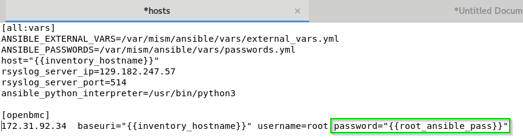

# PlatForm Management CLI (PFMCLI) Ansible BullSequana SH Playbooks

PlatForm Management CLI (PFMCLI) Ansible BullSequana SH Playbooks allow Data Center and IT administrators to use RedHat Ansible to automate and orchestrate the operations (power, update) of MESCA5.

## Supported Platforms
BullSequana SH 

## Prerequisites
Ansible playbooks can be used as is with following prerequisites:
  * Ansible 2.8.5+
  * Python 3.6.8+

## Summary
- [MESCA5 Playbooks](#playbooks)
- [Prerequisites](#prerequisites)
- [What to do first](#what_first)
- [How to change technical states file path](#howto_ts)
- [Warning for updates](#warning_updates)
- [Support](#support)
- [LICENSE](#license)
- [Version](#version)


## <a name="playbooks"></a>BullSequana SH Playbooks
- `disable_ssh.yml`: Disable the SSH mode 
- `disable_indicator_led.yml`: Disable the Systems LED
- `enable_ssh.yml`: Enable the SSH mode 
- `enable_indicator_led.yml`: Enable the Systems LED
- `get_boot.yml`: Get boot options 
- `get_chassis.yml`: Get all chassis details 
- `get_chassis_fan.yml`: Get chassis fan 
- `get_chassis_health.yml`: Get chassis States and Status 
- `get_chassis_inventory.yml`: Get chassis inventory
- `get_chassis_thermals.yml`: Get chassis thermals
- `get_cpu_inventory.yml`: Get cpu inventory
- `get_indicator_led.yml`: Get LED state
- `get_log_services.yml`: Get log services
- `get_manager_all_info.yml`: Get manager all info
- `get_manager_nic_inventory.yml`: Get manager nic inventory
- `get_memory_inventory.yml`: Get memory inventory
- `get_networks.yml`: Get network info
- `get_session_information.yml`: Get session information
- `get_system.yml`: Get system
- `get_system_power.yml`: Get system power state
- `get_systems_health.yml`: Get system states and status
- `get_systems_inventory.yml`: Get systems inventory 
- `get_systems_nic_inventory.yml`: Get NIC inventory
- `list_users.yml`: List users
- `manager_power_force_restart.yml`: Force managers to restart
- `manager_power_graceful_restart.yml`: Gracefully restart the Managers
- `reboot.yml`: Reboot
- `set_chassis_indicator_led to_<state>.yml`: Set the LED to a desired state as a 
- `set_<onetime or continuous>_boot_to_<mode>.yml`: Set boot option to a desired mode
- `set_ntp_servers.yml`: Set the 3 NTP Servers to specific values in external_vars.yml: **ntp_server1** / **ntp_server2** / **ntp_server3**
- `set_power_cap.yml`: Set the power cap to a specific value in external_vars.yml: **power_cap**
- `system_power_off.yml`: Graceful System power off
- `system_power_on.yml`: System power on
- `update_firmware.yml`: Update ONE firmware specified in external_vars.yml: **file_to_upload**
- `update_firmwares_from_TS.yml`: Update firmwares from TS mounted on : **technical_state_path**  
  
## <a name="what_first"></a>What to do first ?

### how to install your playbooks
Install your playbooks with rpm:  
`rpm -i PFMCLI_ANSIBLE_MESCA5_<version>.rpm`  

### how to install your playbooks
Update your playbooks with rpm:  
`rpm -Uvf PFMCLI_ANSIBLE_MESCA5_<version>.rpm`  

:info: Info: Default directory is **/opt/PMF_CLI**  

### how to install your playbook variables
:warning: Warning: Take care to adapt your variables in **/opt/PFM_CLI/vars/external_vars.yml** file

## <a name="prerequisites"></a>Prerequisites

### how to install ansible
1. install python3  
`yum install python3`   
2. install ansible  
`pip3 install ansible`   
3. optionnaly if you use Ansible vault:  
`pip3 install pycryptodome`  
`pip3 install ansible-vault`  
  
:info: Info: Check your python version:   
`python --version`  

:info: Info: Check your ansible python version:  
```#> ansible --version
Here is the basic configuration for ansible:  
config file = /etc/ansible/ansible.cfg file  
inventory = /etc/ansible/hosts file  
variables = path_to_ansible_mesca5/vars/external_vars.yml file  
encrypted passwords = path_to_ansible_mesca5/vars/passwords.yml file  
```
You should run the ansible playbooks on your local directory (/opt/PFM_CLI), let call it **path_to_ansible_mesca5**:
`$path_to_ansible_mesca5> ansible-playbook <my_playbook.yml>`  

:warning: Warning: As explained in the documentation, you may need to force python3 interpreter:  


### how to change your output to yaml or unixy (minimized output)
If you need to change the rendering of your output, feel free to change your stdout_callback in your ansible.cfg file
``` js
stdout_callback = community.general.yaml
or
stdout_callback = community.general.unixy
```
`ansible-doc -t callback -l`  
  
:computer: Choose your prefered rendering in:
  
  
  
### how to add a host in ansible inventory
1. edit /etc/ansible/hosts file
2. add your ip addresses or hostnames followed by baseuri and username variables
```
# add a group optionaly []
[MESCA5]
<here your IP address or hostname> baseuri="{{host}}" username=<here bmc username> password=<here bmc password>
```
3. generate an encrypted password for your password variable
4. replace your password in clear with the name of your encrypted password variable between double brackets 
`password='{{name_of_your_encrypted_variable}}'`

```
# add a group optionaly []
[linux_mesca5]
<here your IP address or hostname> baseuri="{{host}}" username=<here bmc username> password='{{name_of_your_encrypted_variable}}'
```

For test purpose, you can always use a clear password in your *hosts* file  

### how to change your external variables
1. edit path_to_ansible_mesca5/vars/external_vars.yml file
2. comment/uncomment/modify your variables

### general options

General options can always be used with any ansible command as an optional and cumulative parameter

#### how to limit to a group of servers :
```
--limit=<your_group> 
```
*<your_group> should be declared in hosts file*

#### how to specify a BMC password in the CLI on the fly:
```
-e "username=<mon user> password=<mon mot de passe>"
```
#### how to change general variables:
You can refer to Ansible documentation: Visit https://docs.ansible.com/ansible/2.5/user_guide/playbooks_variables.html

To summarize, two main possibilities:
1. As a command parameter, indicate variable/value with --extra-vars as CLI argument :

`ansible-playbook yourfile.yml --extra-vars "your_variable=your_value"`
	
2. In the appropriate external_vars file path_to_ansible_mesca5/vars/external_vars.yml, uncomment and set the desired variable :
`your_variable: your_value`

:warning: Warning : You can set extra variables differently but care the precedence order  
  
Best site that explain variable orders and conflicts: Visit https://subscription.packtpub.com/book/networking_and_servers/9781787125681/1/ch01lvl1sec13/variable-precedence

### update


```console
ansible-playbook update_firmware_with_applytime_immediate.yml
```


#### how to retrieve chassis inventory

```console
ansible-playbook get_chassis_inventory.yml
```

ex: [root@awx firmware]# ansible-playbook --limit=openbmc -vv get_chassis_inventory.yml

### power

#### how to stop host

```console
ansible-playbook power_off.yml
```
ex: [root@awx power]# ansible-playbook --limit=openbmc -e "username=your_user password=your_pass" power_off.yml 

#### how to start host

```console
ansible-playbook power_on.yml
```
ex: [root@awx power] ansible-playbook --limit=openbmc -e "username=root password=mot_de_passe" power_on.yml


### power capabilities

#### how to set the power capability upper limit
in your external_vars file, just adapt and uncomment the appropriate value:
power_cap: 500

### countdowns

#### how to change countdowns 
in your external_vars file, just change the appropriate value:

```
# Count down before checking a successfull reboot in MINUTES
reboot_countdown: 3
# Count down before checking a successfull for power on/off in SECONDS
poweron_countdown: 5
poweroff_countdown: 5
```

### maxretries

#### how to change countdowns 
in your external_vars file, just change the appropriate value:

```
# Max retries for reboot in in repeated
reboot_maxretries: 10
# Max retries for power on/off in repeated times
poweron_maxretries: 10
poweroff_maxretries: 10
```

### how to use a CLI Vault
1. generate your encrypted password: See [How to manage encrypted passwords](#howto_manage_ansible_password)
2. run your playbook
`ansible-playbook --vault-id bull_password@prompt  get_chassis_fan.yml`

*@prompt means that you should enter the Vault password during the process (hidden)*

## <a name="howto_proxy"></a>How to change your proxy
:computer: Info: If your IP address is not declared in proxy: You may need to add your IP address in your NO_PROXY configuration to bypass the proxy.
Either permanently in the /etc/profile.d/proxy.sh file or in command line for the current session only, like this: 
```console
export NO_PROXY="<your bullsequana mesca5 IP address>,$NO_PROXY"
```

## <a name="howto_ts"></a>How to change technical states file path
### default value
By default, the root directory is /mnt.

So, in your inventory, you can define the `technical_state_path:` variable to whatever you want  
`technical_state_path: /mnt`  

### change your file to upload name
:no_entry: Warning: Be careful to adapt the file_to_upload variable of your inventory  

`file_to_upload: /mnt/OMF_CEB_<your version>.sign.tar.gz`  

### change your technical states file path
:no_entry: Warning: Be careful to adapt the technical_state_path variable of your inventory  

`technical_state_path: /mnt`  

## <a name="howto_manage_ansible_password"></a>How to manage Ansible encrypted passwords
### generate an Ansible native encrypted password
1. execute the following native ansible command with the name of your password and the real password you want to encrypt  
`generate_encrypted_password_for_Ansible.sh --name your_password_name your_real_password_to_encrypt`  
2. you are prompted for a vault password you should remember

example  

```console
# ../generate_encrypted_password_for_Ansible.sh --name "bmc_root_password" "p@s$w0rd[$#34"
[DEPRECATION WARNING]: Ansible will require Python 3.8 or newer on the
controller starting with Ansible 2.12. Current version: 3.6.8 (default, Apr 16
2020, 01:36:27) [GCC 8.3.1 20191121 (Red Hat 8.3.1-5)]. This feature will be
removed from ansible-core in version 2.12. Deprecation warnings can be disabled
 by setting deprecation_warnings=False in ansible.cfg.
New vault password (bull_password):
Confirm new vault password (bull_password):
bmc_root_password: !vault |
          $ANSIBLE_VAULT;1.2;AES256;bull_password
          36323636636436333566303333313838653530316464333731326332633764316538303134653439
          6339393165353439353836623636643463663561306537370a366265353930306562313336373637
          63393737363433386465663833393033316632353937666364326361386233353066363233633165
          3865313836306432370a636330313336386634333333393333666262303736373133383938326164
          3932
you can now use your variable in your Ansible inventory
edit the your hosts and modify password="{{ bmc_root_password }}"
```

### use your Ansible encrypted password
You should replace " password= " in your hosts file




:lock: Info: you should run your playbooks with *--ask-vault-pass* or *--vault-id* in command line (alternatively you can indicate a vault_password_file in your ansible.cfg : See next section)  

*--ask-vault-pass*

```console
# ansible-playbook --ask-vault-pass  get_chassis_fan.yml
[DEPRECATION WARNING]: Ansible will require Python 3.8 or newer on the controller starting with Ansible 2.12. Current version: 3.6.8
(default, Apr 16 2020, 01:36:27) [GCC 8.3.1 20191121 (Red Hat 8.3.1-5)]. This feature will be removed from ansible-core in version 2.12.
 Deprecation warnings can be disabled by setting deprecation_warnings=False in ansible.cfg.
Vault password:
Executing playbook get_chassis_fan.yml

- Fan Inventory on hosts: all -
get Chassis Fan Inventory...
  10.22.84.156 ok
debug...
  10.22.84.156 ok: {
    "changed": false,
    "result": {
        "changed": false,
        "failed": false,
        "redfish_facts": {
            "fan": {
                "entries": [],
                "ret": true
            }
        }
    }
}

- Play recap -
  10.22.84.156               : ok=2    changed=0    unreachable=0    failed=0    rescued=0    ignored=0
```

or alternatively *--vault-id*

```console
# ansible-playbook --vault-id bull_password@prompt  get_chassis_fan.yml
[DEPRECATION WARNING]: Ansible will require Python 3.8 or newer on the controller starting with Ansible 2.12. Current version: 3.6.8
(default, Apr 16 2020, 01:36:27) [GCC 8.3.1 20191121 (Red Hat 8.3.1-5)]. This feature will be removed from ansible-core in version 2.12.
 Deprecation warnings can be disabled by setting deprecation_warnings=False in ansible.cfg.
Vault password (bull_password):
Executing playbook get_chassis_fan.yml

- Fan Inventory on hosts: all -
get Chassis Fan Inventory...
  10.22.84.156 ok
debug...
  10.22.84.156 ok: {
    "changed": false,
    "result": {
        "changed": false,
        "failed": false,
        "redfish_facts": {
            "fan": {
                "entries": [],
                "ret": true
            }
        }
    }
}

- Play recap -
  10.22.84.156               : ok=2    changed=0    unreachable=0    failed=0    rescued=0    ignored=0
```

:warning: Warning: If you do *NOT* add <span style="color:blue">--vault-id followed bull_password@prompt</span> vault identifier, you will have the following error: <span style="color:red">*no vault secrets found*</span>
 
```console
# ansible-playbook get_chassis_fan.yml
[DEPRECATION WARNING]: Ansible will require Python 3.8 or newer on the controller starting with Ansible 2.12. Current version: 3.6.8
(default, Apr 16 2020, 01:36:27) [GCC 8.3.1 20191121 (Red Hat 8.3.1-5)]. This feature will be removed from ansible-core in version 2.12.
 Deprecation warnings can be disabled by setting deprecation_warnings=False in ansible.cfg.
Executing playbook get_chassis_fan.yml

- Fan Inventory on hosts: all -
get Chassis Fan Inventory...
  10.22.84.156 failed | msg: An unhandled exception occurred while templating '{{ bmc_root_password }}'. Error was a <class 'ansible.parsing.vault.AnsibleVaultError'>, original message: Attempting to decrypt but no vault secrets found

- Play recap -
  10.22.84.156               : ok=0    changed=0    unreachable=0    failed=1    rescued=0    ignored=0
```
  
:lock: Info: you should install optional prerequisites => See [install ansible locally](#install_locally)

### add a Ansible vault password file
The previous chapter create only encrypted variables in a vault-id named *bull_password*.    
You are prompted to provide the *vault password*   
  
You can specify a *vault-password-file* in ansible.cfg file  

The following steps is an example of how to create a file that contains the vault password, to decrypt all passwords in passwords.yml file, but you can use whatever ansible vault technology you want, especially a python script instead of a clear vault password file  
 
1. create a file - preferably named *bull_password.yml* :

```console
# ll /etc/ansible/bull_password.yml
-rw-r--r-- 1 root root 5 Dec 15 17:55 /etc/ansible/bull_password.yml
```

2. edit your *ansible.cfg* file 
3. uncomment the vault_password_file section
4. add the /path/filename to your vault password file 
```
# If set, configures the path to the Vault password file as an alternative to
# specifying --vault-password-file on the command line.
vault_password_file = /etc/ansible/bull_password.yml
```

5. edit the file <span style="color:blue">generate_encrypted_password_for_Ansible.sh</span>, uncomment first line and comment second line:
```
# if you specify vault_password_file in your ansible.cfg, just uncomment first line and comment second line:
ANSIBLECMD="ansible-vault encrypt_string" # in ansible.cfg vault_password_file = /path/to/bull_password
# ANSIBLECMD="ansible-vault encrypt_string --vault-id bull_password@prompt"
```
6. run the folowing command
```console
# ../generate_encrypted_password_for_Ansible.sh --name "bmc_root_password" "my_secre!p@ssw0rd"
```
where bmc_root_password is the name of your password and my_secre!p@ssw0rd is your real secret password
  
you can now generate as many encrypted password variables as needed and play your playbooks without been prompted to the vault password

:warning: Warning: Vault password is in clear inside, care to protect strongly the file or prefer python script to provide vault password 

:thumbsup: Best Practice: Vault passwords could be retrieved from python script. For more information See https://docs.ansible.com/ansible/latest/user_guide/vault.html


## <a name="warning_updates"></a>Warning for updates
:warning: Never change original playbooks => duplicate playbooks  
  
You can use the directory ansible/playbooks to add your own playbooks.  

## <a name="support"></a>Support
* This branch corresponds to the release actively under development.

## <a name="license"></a>LICENSE
This project is licensed under GPL-3.0 License. 
Please see the [LICENSE](LICENSE) for more information

## <a name="version"></a>Version
Version: PFMCLI_ANSIBLE_MESCA5 1.0.0  
